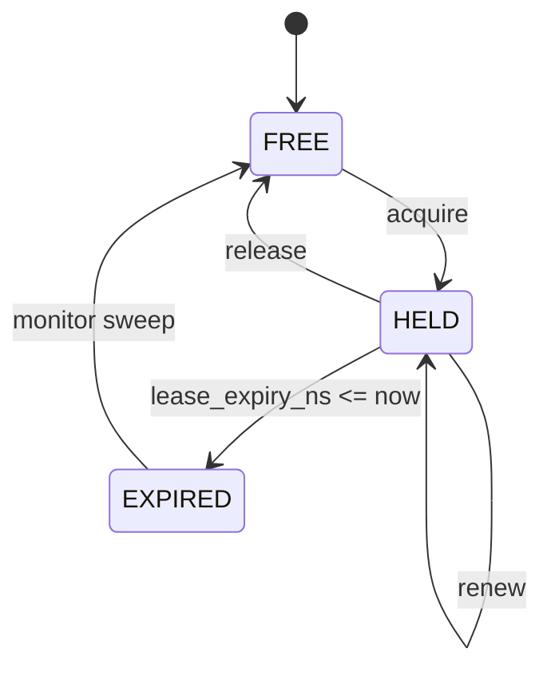

# LockServer

**A lease-based lock coordination primitive with monotonic fencing tokens (single-node, multi-client).**

LockServer is a production-oriented coordination service that provides:

* Exclusive lock acquisition with lease expiration

* Monotonic fencing tokens for stale-writer prevention

* Heartbeat-based lease renewal

* Safe release semantics

* Automatic expiration detection

* Bounded retry behavior

* Structured logging and Prometheus metrics

It is intentionally single-node (no Raft/Paxos) and focuses on correctness under concurrency, failure modeling, and operational observability.

## 1. Motivation

Many distributed systems require:

* Exclusive execution (cron leaders, migrations, compaction jobs)

* Mutual exclusion across multiple workers

* Protection against stale writers after crash or network delay

A naive lock is insufficient because:

* Clients can crash mid-critical section.

* Network delays can cause lease expiry during execution.

* A stale client may still attempt to write after losing ownership.

LockServer addresses this using:

* **Lease-based ownership**

* **Monotonic fencing tokens**

* **Atomic transactional state transitions**

## 2. API Overview

**Acquire**


```python
POST /v1/locks/{lock}/acquire
```
Returns:
* ```200 OK``` → acquired with ```lease_id``` and ```fencing_token```

* ```409 Conflict``` → currently held (includes recommended retry)

------
**Renew (Heartbeat)**

```python
POST /v1/locks/{lock}/renew
```

Extends lease if:

* same owner

* same lease_id

* same fencing_token

* lease not expired

---------

**Release**
```python
POST /v1/locks/{lock}/release
```

Succeeds only if:

* owner_id matches

* lease_id matches

* fencing_token matches

------------

**Get**
```python
GET /v1/locks/{lock}
```
Returns current snapshot (diagnostic)

## 3. Correctness Guarantees
### Safety

### S1: Exclusive Ownership
At any time, at most one active lease exists per lock.

### S2: Monotonic Fencing
Each successful acquisition increments a strictly increasing fencing token.

If downstream systems enforce:
```python
accept only if token >= last_seen_token
```
then stale writers cannot overwrite newer state.

### S3: Safe Release
A stale client cannot release a lock after:

* lease expiry

* re-acquisition by another client

Release requires matching (```owner_id```, ```lease_id```, ```fencing_token```).


### Liveness

### L1: Expiry-Based Progress
If a client crashes, its lease expires and another client can acquire.

### L2: Bounded Retry

Acquire returns ```recommended_retry_ms``` to prevent thundering herd.


## 4. Failure Model
LockServer explicitly models:

### Client crash during lease
Lease expires → monitor clears → lock becomes acquirable.

### Lease expiry during critical section
Fencing token prevents stale client from overwriting newer writes.

### Network delay
Renew checks (```lease_id```, ```fencing_token```) atomically; stale renews are rejected.

### Double acquire attempts
Serializable transaction ensures single winner.

### SQLite busy under contention
Handled as retryable (BUSY_RETRY); counted via metrics.


## 5. State Model

### Lock Table

```python
lock_name (PK)
owner_id
lease_id
fencing_token
lease_expiry_ns
version
```

### Token Table
```python
lock_name (PK)
last_token
```

### State Transitions


All transitions occur inside **serializable transactions**.


## 6. Fencing Token Model
Each acquisition performs:
1. `UPDATE tokens SET last_token = last_token + 1`

2. Assigns that value to the lease

This guarantees:
```python
token(n+1) > token(n)
```

Downstream systems must enforce fencing by rejecting stale tokens.


## 7. Expiration Monitor
Background process:

* Updates `locks_held` gauge

* Clears expired rows

* Increments lock_expired_total

* Structured logs for sweep latency

This improves operational visibility without affecting correctness.


## 8. Metrics

Prometheus metrics exposed at `/metrics`:

| Metric                            | Type              | Description             |
| ----------------------------------| ------------------| ----------------------- |
| `lock_acquire_total{result}`      | counter           | success / fail / busy   |
| `lock_renew_total{result}`        | counter           | success / fail / busy   |
| `lock_release_total{result}`      | counter           | success / fail / busy   |
| `lock_op_latency_ms{op}`          | histogram         | operation latency       |
| `lock_db_busy_total{op}`          | counter           | sqlite contention       |
| `locks_held`                      | gauge             | active unexpired locks  |
| `lock_expired_total`              | counter           | expired leases detected |

## 9. Concurrency & Load Testing

Tested under:
```python
go test -race
go run ./cmd/lockload --clients 80 --duration 20s
```

Validated:

* No stale writer can overwrite newer write (fencing invariant)

* Stale release cannot clobber new owner

* Heartbeat maintains lease under contention

* Correct behavior under induced expiry

## 10. Client SDK

Includes a minimal Go SDK:

* `AcquireWithRetry`

* `StartHeartbeat`

* `Release`

* `FencingToken()` accessor

Supports bounded retries and jitter

## 11. Performance Characteristics

* Single SQLite node

* Serializable isolation

* Throughput limited by DB write contention

* Hot-lock contention results in expected high conflict rate

This is designed as a coordination primitive, not a high-throughput distributed lock cluster.

## 12. Limitations

* Single-node (no HA)

* Requires downstream fencing enforcement

* SQLite contention under extreme write concurrency

* No fairness guarantees

* No priority scheduling

## 13. Why No Raft?

LockServer is intentionally:

* Single-node

* Simple

* Correct under concurrency

This project focuses on modeling coordination semantics precisely without introducing distributed consensus complexity.

## 14. Running

```Bash
CGO_ENABLED=1 go run ./cmd/lockserver
```

## 15. Example

```Go
lease, err := client.AcquireWithRetry(ctx, "job-lock", "worker-1", opts)

token := lease.FencingTokenValue()
// downstream write must enforce fencing

hbErrs := client.StartHeartbeat(ctx, lease, hbOpts)

defer client.ReleaseOnce(ctx, lease)
```

## 16. Project Goals
This project demonstrates:

* Concurrency control

* Lease modeling

* Failure-aware API design

* Fencing token correctness

* Operational observability

* Production-grade shutdown handling